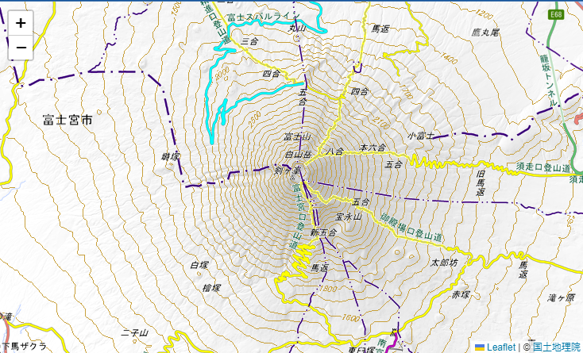
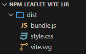

# Viteを利用してvanillaJSでnpmを利用できる環境を作成する(ライブラリモードでjsのみ出力)

## はじめに

(Webアプリの場合)npmでインストールしたライブラリは、CDNから読み込むような感じでは使えません

`import`や `require`でライブラリを読み込み、さらにそれを[バンドル](https://qiita.com/kome1996/items/1731e53cfefed79eafcc)する必要があります

以前、[rollup.js](https://rollupjs.org/)を使って[ビルドする手順](https://qiita.com/murasuke/items/0ccc088b3a4dde8bf385)を作成したのですが、Hot Module Replacement(HMR、JSの変更を即時でブラウザに適用する機能)ができないため、ちょっとした修正のたびにビルドを行う必要があり面倒でした

https://qiita.com/murasuke/items/0ccc088b3a4dde8bf385

また、[npmのライブラリををvite＋vanillaJS環境で実行する環境](https://qiita.com/murasuke/items/25c149be32b5ee86cb3d)では、設定不要で実行できますが
htmlファイルを含めてバンドルされてしまい、ライブラリとしての利用には不便でした。

https://qiita.com/murasuke/items/25c149be32b5ee86cb3d

そこで今回は、[viteのライブラリモード](https://ja.vitejs.dev/guide/build.html#library-mode)を利用して、htmlファイルを含まないバンドルを行います

## 環境作成

* node.jsはインストール済みの想定
* [Leaflet](https://leafletjs.com/)をnpmでインストールして、簡単な地図アプリを作成します
* bash(windows上のgit-bash)を利用しています

### 1. viteのテンプレート(`vanilla`)を利用して環境を作成

[vanilla](https://ja.wikipedia.org/wiki/%E3%83%90%E3%83%8B%E3%83%A9_(%E3%82%BD%E3%83%95%E3%83%88%E3%82%A6%E3%82%A7%E3%82%A2))とは

日本語に訳すと「素の」、「原型のまま」といった意味です(バニラ味はアイスの「デフォルト」や「プレーン」な味というイメージだから)

ライブラリもフレームワークも使わないで JS を書くことを`Vanilla JS`と呼びます

（テンプレートには、`vanilla`以外にも`React`や`Vue`用が用意されています）

```bash
$ npm create vite@latest npm_leaflet_vite -- --template vanilla

Scaffolding project in E:\Users\tkykn\git\bundle\npm_leaflet_vite...

Done. Now run:

  cd npm_leaflet_vite
  npm install
  npm run dev
```
vanillaテンプレートでは、下記ファイルが生成されました


### 2. vite環境とleafletをインストール
```bash
$ cd npm_leaflet_vite
$ npm install
$ npm i leaflet
```

### 3. テンプレートに含まれる不要なファイルを削除

```bash
$ rm style.css javascript.svg counter.js main.js
```


### 4. `./src/leaflet_vite.js`ファイルを作成(leaflet.jsで地図を表示する)

[Leaflet](https://leafletjs.com/)公式[Quick Start Guide](https://leafletjs.com/examples/quick-start/#:~:text=example%20stand%2Dalone.-,Preparing%20your%20page,-Before%20writing%20any)ページのサンプルをもとに、地図を国土地理院の[地理院タイル](https://maps.gsi.go.jp/development/ichiran.html)に変更したサンプルプログラムです

実行すると富士山頂を中心とした地図が表示されます


```javascript:./src/leaflet_vite.js
// npmでインストールしたライブラリをimport
import L from 'leaflet';
import 'leaflet/dist/leaflet.css';

const latLen = [35.3607411, 138.727262]; // 富士山頂の緯度経度
const map = L.map('app'); // 地図を生成
map.setView(latLen, 12); // 緯度経度、ズームレベルを設定
// タイルレイヤを生成し、地理院タイルを地図に追加
L.tileLayer('https://cyberjapandata.gsi.go.jp/xyz/std/{z}/{x}/{y}.png', {
  attribution: '&copy; <a href="https://maps.gsi.go.jp/development/ichiran.html">国土地理院</a>',
}).addTo(map);

// mapをエクスポートする
export default map;
```

### 5. index.htmlファイルの書き換え(&lt;style&gt;タグの追加)

開発サーバー(`npm run dev`)から実行できるようにするため、index.htmlファイルを修正します


* &lt;head&gt;タグを追加(これがないとleafletの高さが0になってしまい表示されないため)
* jsファイルを新しく作成したファイルに変更

```diff_HTML:index.html
<!doctype html>
<html lang="en">
  <head>
    <meta charset="UTF-8" />
    <link rel="icon" type="image/svg+xml" href="/vite.svg" />
    <meta name="viewport" content="width=device-width, initial-scale=1.0" />
    <title>Vite App</title>
+   <style>
+     /* 画面全体に地図を表示 */
+     body { margin: 0 }
+     #app { height: 100vh; }
+   </style>
  </head>
  <body>
    <div id="app"></div>
-   <script type="module" src="/main.js"></script>
+   <script type="module" src="/src/leaflet_vite.js"></script>
  </body>
</html>
```

### 6.開発サーバーで動作することを確認

`npm run dev`を実行して、URLを開くと地図が表示されることを確認します

(ここまでは)設定ファイルを作る必要もありません
```
$  npm run dev
  VITE v5.2.9  ready in 186 ms

  ➜  Local:   http://localhost:5173/
  ➜  Network: use --host to expose
  ➜  press h + enter to show help
```
* 実行するとこんな感じで富士山が表示されます（拡大、縮小、移動もできます）




## 環境作成(ライブラリビルド用設定)

次に「ライブラリ(jsファイルのみ)をビルドする設定ファイル作成(vite.config.js)」と、「ライブラリjsを読み込んで動作確認を行うためのhtmlファイル作成」します

### 7. ライブラリをビルドする設定ファイル作成(vite.config.js)

[viteのライブラリモード](https://ja.vitejs.dev/guide/build.html#library-mode)を利用するために、設定ファイル(vite.config.js)を作成します

最低限必要な設定
* `entry`: ビルドを行うためのエントリポイントとなるファイル
* `filename`:  生成するファイルのファイル名を指定
* `formats`: 生成するモジュール形式を指定(デフォルト設定では`umd`形式も作成されるので`es`のみに変更)

```javascript:vite.config.js
import { resolve } from 'path';
import { defineConfig } from 'vite';

export default defineConfig({
  build: {
    lib: {
      // https://ja.vitejs.dev/config/build-options.html#build-lib
      entry: resolve(__dirname, 'src/leaflet_vite.js'), // エントリポイント
      fileName: 'bundle', // 生成するファイルのファイル名を指定
      formats: ['es'], // 生成するモジュール形式を指定。デフォルト['es', 'umd'] (umdの場合、グローバル変数として公開する名前の設定(build.lib.name)が必要)
    },
  },
});
```

### 8. ライブラリjsを読み込んで動作確認を行うためのhtmlファイル作成

`index.html`ファイルをコピー(lib-test.html)して、下記2点を変更します

* cssファイルの読み込み追加
* jsファイルのパス(src)の変更

```html:lib-test.html
<!doctype html>
<html lang="en">
  <head>
    <meta charset="UTF-8" />
    <link rel="icon" type="image/svg+xml" href="./dist/vite.svg" />
    <meta name="viewport" content="width=device-width, initial-scale=1.0" />
    <title>Vite App</title>
    <link rel="stylesheet" type="text/css" href="./dist/style.css" />
    <style>
      /* 画面全体に地図を表示 */
      body { margin: 0 }
      #app { height: 100vh; }
    </style>
  </head>
  <body>
    <div id="app"></div>
    <script type="module" src="./dist/bundle.js"></script>
  </body>
</html>

```


### 9. ビルドと動作確認

```
$ npm run build
$ npx http-server ./
Available on:
  http://192.168.3.7:8080
  http://127.0.0.1:8080
  http://172.28.160.1:8080
Hit CTRL-C to stop the server
```

ビルドで生成されたファイル



ブラウザで「http://127.0.0.1:8080 」を開くと、開発サーバーで実行したのと同じ地図アプリが表示されます
